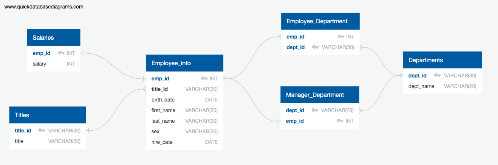

# SQL Challenge

## Background
In this assignment I took on the role of data engineer employee at a fictional company called Pewlett Hackard.  
I was tasked with a project to research people that the company employed during the 1980s and 1990s. 
The only data I had to work with included 6 CSV files with varying employee information.
I performed data modeling, data engineering, and data analysis.

## Data Modeling
1. Inspected the CSV files 
2. Created an Entity Relationship Diagram (ERD) of db tables and relationships.

  
  

## Data Engineering
1. Created a table schema for each CSV file specifying the data types, primary keys, foreign keys, and other constraints such as composite keys.
2. Imported each CSV file into its corresponding SQL table.

## Data Analysis
1. Wrote SQL queries to further understand the employee data:
   List the employee number, last name, first name, sex, and salary of each employee.
   List the first name, last name, and hire date for the employees who were hired in 1986
   List the manager of each department along with their department number, department name, employee number, last name, and first name.
   List the department number for each employee along with that employee’s employee number, last name, first name, and department name.
   List first name, last name, and sex of each employee whose first name is Hercules and whose last name begins with the letter B.
   List each employee in the Sales department, including their employee number, last name, and first name.
   List each employee in the Sales and Development departments, including their employee number, last name, first name, and department name.
   List the frequency counts, in descending order, of all the employee last names (that is, how many employees share each last name).

      

